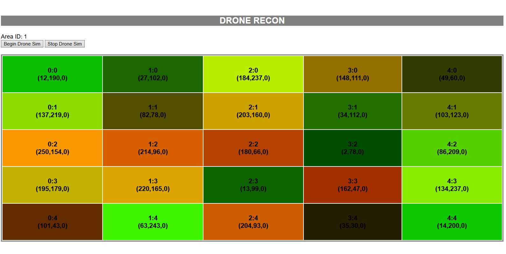
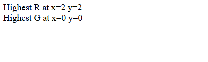

# Farm Drone Recon System 🌽🚜

A Java web application that simulates agricultural drone reconnaissance and data collection. This project uses **JSP**, **Servlets**, **REST Web Services**, **JSON**, and **SQLite** to collect, store, and analyze survey information.

## Project Overview

The system consists of two web applications.

### Drone Recon Application (`dronerecon`)

Simulates a drone surveying a farm field. The drone travels through a grid, collects tile data, and communicates with backend web services using JSON.

### Drone Recon Portal (`dronereconportal`)

Stores collected survey information in an SQLite database and provides a search interface for viewing results and identifying areas with the highest recorded values.

## Features

- Drone grid simulation
- RESTful web services
- JSON-based communication
- JSP web interfaces
- Java Servlets
- SQLite database integration
- Area search functionality
- Automated survey data collection

## Technologies Used 🖥️

- **Java**
- **JSP**
- **Servlets**
- **Apache Tomcat**
- **REST APIs**
- **JSON**
- **SQLite**
- **Git**
- **GitHub**

## Project Structure

```text
src/
├── AreaGridTile.java
├── DBManager.java
├── DroneDataService.java
└── PortalDBService.java

webapps/
├── dronerecon/
│   ├── drone_launch.jsp
│   └── drone_sim.jsp

└── dronereconportal/
    ├── areasearch.jsp
    └── arearesults.jsp
```

## Running the Project

### Requirements

- Java JDK
- Apache Tomcat
- SQLiteStudio (Optional - used to view and inspect the SQLite database)

### Deployment

1. Copy the `dronerecon` folder into Tomcat's `webapps` directory.
2. Copy the `dronereconportal` folder into Tomcat's `webapps` directory.
3. Start Apache Tomcat.
4. Open `drone_launch.jsp` to begin the drone simulation. (http://127.0.0.1:8080/dronerecon/drone_launch.jsp)
5. Open `areasearch.jsp` to access the data portal. (http://127.0.0.1:8080/dronereconportal/areasearch.jsp)

## Screenshots 📷

### Drone Survey Grid



### Area Results



## Concepts Demonstrated

- Client-server architecture
- REST web services
- JSON data exchange
- JSP and Servlet development
- Database connectivity
- SQLite queries
- Dynamic web applications

## Disclaimer Notice ⚠️

This project was completed under Prof. Gillespie and is published for educational and portfolio purposes.

Please do not submit or represent any portion of this work as your own academic assignment.

## Author 📚

**Raksa Ouk**
